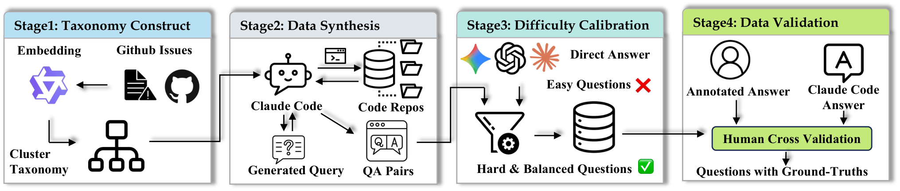
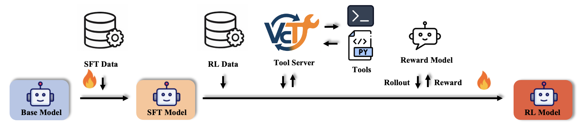

# SWE-QA-Pro: A Representative Benchmark and Scalable Training Recipe for Repository-Level Code Understanding

[**📖 arXiv**](https://arxiv.org/abs/2603.16124) | [**🤗 SWE-QA-Pro Bench**](https://huggingface.co/datasets/TIGER-Lab/SWE-QA-Pro-Bench) |

---

## 📢 News

- **🔥 [2026-3-20] SWE-QA-Pro Bench is publicly released! Please check our [paper](https://arxiv.org/abs/2603.16124) and [benchmark](https://huggingface.co/datasets/TIGER-Lab/SWE-QA-Pro-Bench). The model and code will be released soon.**


## 📘 Introduction
**SWE-QA-Pro** is a benchmark and training framework for **agentic repository-level code understanding**, enabling models to explore, reason over, and verify real-world codebases. This work targets key limitations in existing evaluations:

- Limited diversity: benchmarks focus on popular repositories, missing long-tail software tasks
- Knowledge leakage: many questions can be solved without interacting with the codebase
- Weak tool necessity: unclear whether agentic workflows are actually required

To address these challenges, we introduce two key components:
1. **SWE-QA-Pro Benchmark:**

    
    A repository-level QA benchmark built from diverse long-tail repositories with executable environments.

    - Questions are seeded from real issues and grouped via clustering to ensure topic diversity
    - Each item is grounded in actual code with human verification
    - A difficulty calibration pipeline filters out questions solvable by direct-answer models

    This results in a benchmark where agentic exploration is necessary, with up to a **~13-point** performance gap between tool-using agents and direct answering.


2. **Agentic Training Pipeline & Models:**

    
    A scalable framework for learning repository-level agentic reasoning.

    - Generates synthetic tool-use trajectories and grounded supervision
    - Trains models with a two-stage recipe (SFT → RLAIF)
    - Enables small open models to learn multi-step reasoning, tool usage, and code navigation

    Models trained with this pipeline achieve strong performance, with our SWE-QA-Pro 8B model surpassing GPT-4o by **+2.3 points** on SWE-QA-Pro and substantially narrowing the gap to state-of-the-art proprietary models.


## 🛠️ TODO
- [x] Release the dataset
- [ ] Release the evaluation code
- [ ] Release the model
- [ ] Release the training code


## 📬 Contact
- **Songcheng Cai**: songcheng.cai@uwaterloo.ca  
- **Zhiheng Lyu**: z63lyu@uwaterloo.ca
- **Wenhu Chen**: wenhu.chen@uwaterloo.ca  

---

## 📖 Citation

**BibTeX:**

```bibtex
@article{cai2026sweqapro,
      title={SWE-QA-Pro: A Representative Benchmark and Scalable Training Recipe for Repository-Level Code Understanding}, 
      author={Songcheng Cai and Zhiheng Lyu and Yuansheng Ni and Xiangchao Chen and Baichuan Zhou and Shenzhe Zhu and Yi Lu and Haozhe Wang and Chi Ruan and Benjamin Schneider and Weixu Zhang and Xiang Li and Andy Zheng and Yuyu Zhang and Ping Nie and Wenhu Chen},
      journal={arXiv preprint arXiv:2603.16124},
      year={2026},
}
